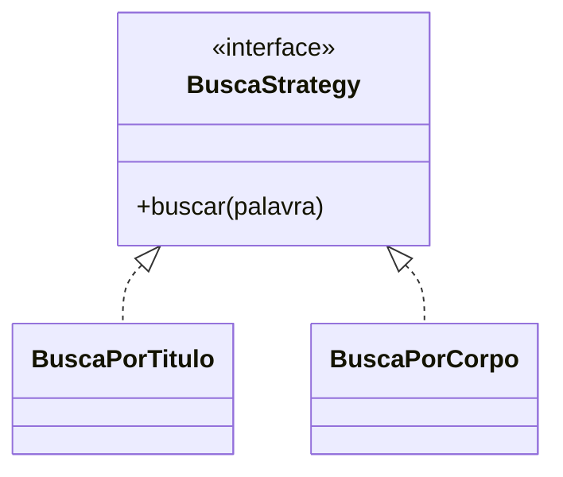

# PADROES_PROPOSTOS.md - Proposta de Padroes 
 
## Padrao 1: Strategy 
 
**Funcionalidade:** Busca de perguntas 
 
**Problema:** Diferentes estrategias de busca (titulo, corpo, tags). 
 
**Solucao:** Interface BuscaStrategy com implementacoes concretas. 
 
**Diagrama:** 
 

 
## Padrao 2: Observer 
 
**Funcionalidade:** Notificacao de novas respostas 
 
**Problema:** Notificar multiplos usuarios quando uma resposta e adicionada. 
 
**Solucao:** Subject (Pergunta) notifica Observers (Notificadores). 
 
## Padrao 3: Factory 
 
**Funcionalidade:** Criacao de notificacoes 
 
**Problema:** Criar diferentes tipos de notificacao (email, push, app). 
 
**Solucao:** NotificacaoFactory centraliza a criacao. 
