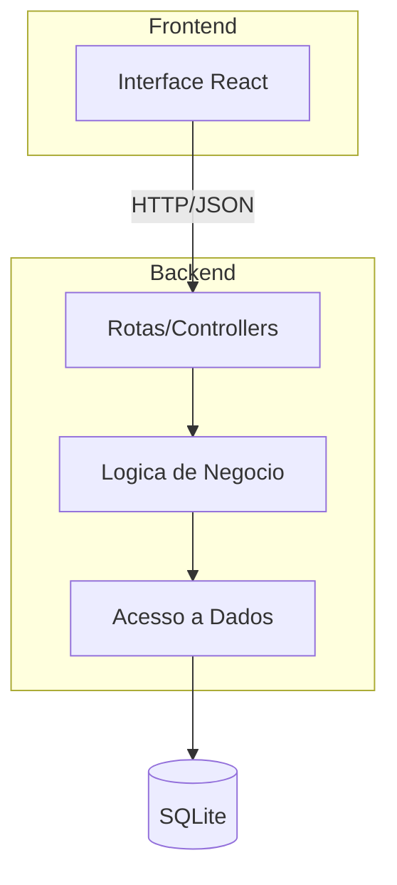

# ARQUITETURA.md - Analise Arquitetural 
 
## a) Identificacao da Arquitetura 
 
O sistema ESM Forum segue uma arquitetura **Cliente-Servidor** com separacao em **camadas**: 
 
1. **Frontend (React)**: Camada de apresentacao 
2. **Backend (Node.js/Express)**: Camada de negocio e API 
3. **Banco de Dados (SQLite)**: Camada de persistencia 
 
### Comunicacao Frontend-Backend 
 
- Frontend consome API REST via HTTP 
- Formato: JSON 
- Endpoints: /perguntas, /respostas, /usuarios 
 
## b) Diagrama Arquitetural 
 

